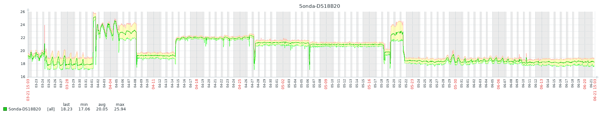
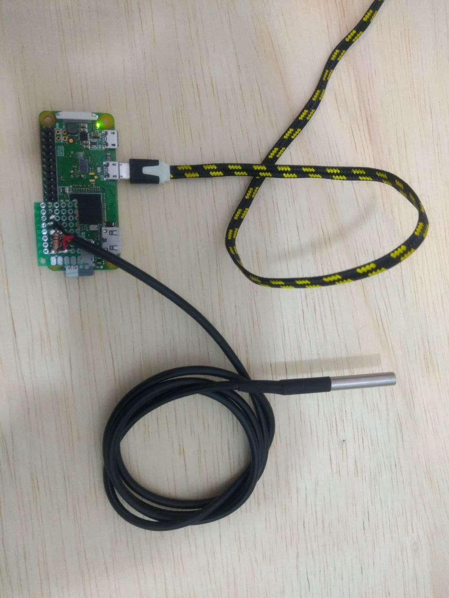
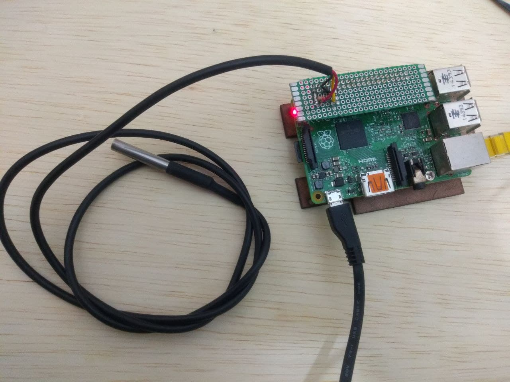

# Open-EMS-PI-ZBX
Environmental Monitoring System on Raspberry PI for Zabbix

# Overview

Open documentation of a prototype using Raspberry Pi with sensor for monitoring Computing Environment, infrastructure rooms or equipment.

Project used to integrate with a NOC and integrated with the Zabbix monitoring tool

DS18B20 sensor used.

# Template
Version Zabbix 4.4.9

-[Template OS Linux Zabbix agent Raspberry PI](https://raw.githubusercontent.com/EstevesDouglas/Open-EMS-PI-ZBX/main/templates/Template_OS_Linux_Zabbix_agent_Raspberry_PI.xml)

    *Network Interfaces
    *NTP
    *Sistema de Arquivos
    *Status
    *Temperatura (DS18B20)
    
# Code sensor

Python program that reads the DS18B20 Temperature Sensor, together with the template, monitoring is carried out in conjunction with the Zabbix-agent using the Userparameter feature.

-[ ds18b20.py](https://raw.githubusercontent.com/EstevesDouglas/Open-EMS-PI-ZBX/main/scripts/ds18b20.py)

# Monitoring on Zabbix
Use case

# Log

# References
- [Data-center-temperature-monitor](https://github.com/hixair/Data-center-temperature-monitor)
- [Do It Yourself: SNMP Temperature Monitoring System](https://www.norwegiancreations.com/2017/06/do-it-yourself-snmp-temperature-monitoring-system/)
- [RASPBERRY PI DS18B20 TEMPERATURE SENSOR TUTORIAL](https://www.circuitbasics.com/raspberry-pi-ds18b20-temperature-sensor-tutorial/)
- [Zabbix Proxy 4.4 com Raspberry PI 3 - 28/07](http://www.unicast.com.br/configurando-zabbix-proxy-4-4-com-raspberry-pi-3/)
- [Zabbix Página oficial](https://www.zabbix.com/download?zabbix=5.0&os_distribution=raspbian&os_version=10_buster&db=mysql&ws=apache)
- [Wide range of Hygrometers:DHT22, AM2302, AM2320, AM2321, SHT71, HTU21D, Si7021, BME280](http://www.kandrsmith.org/RJS/Misc/Hygrometers/calib_many.html)
